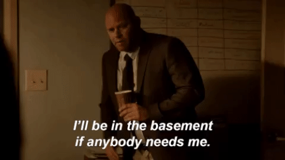

# 🚫💩 Basement-Shitting Prevention Team 🚫💩

    
    

/play 56k

## Aufgabenstellung
Die detaillierte [Aufgabenstellung](TASK.md) beschreibt die notwendigen Schritte zur Realisierung.

## Recherche

## Implementierung

## Quellen
